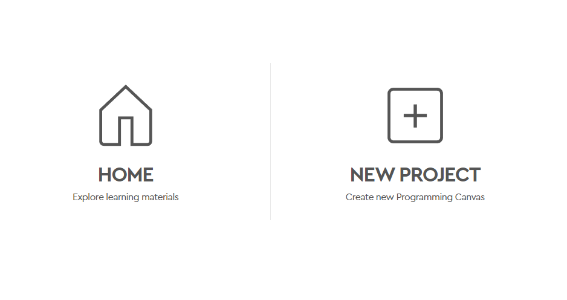

# Lego SPIKE Prime

:::info[Importante]
**Duracion:** 15 minutos
:::

### Objetivos:
- Introducir brevemente los kits LEGO SPIKE Prime 
- Explicar a los estudiantes como se conformaran los equipos.
- Realizar la primera interacción con los kits LEGO SPIKE Prime.

## 4. Presentación del Objetivo de la Sesión:
### Objetivos:
- Explicar cómo la robótica puede ayudar a resolver problemas ambientales y qué se espera lograr en la sesión.
- Relacionar la robótica con los problemas ambientales discutidos, destacando ejemplos de cómo los robots pueden contribuir a soluciones sostenibles.

:::tip[Estrategia Recomendada]

Utilizar ejemplos que relacionen a problemas ambientales comununes con soluciones que hagan uso de sistemas roboticos.

- Un gran problema ambiental es la contaminación de los océanos. Los robots pueden ser diseñados para recoger plásticos y otros desechos del agua, ayudando a mantener nuestros océanos limpios.
- Otro desafío es la deforestación o la perdida de bosques provocada por los humanos. Los robots pueden ser utilizados para plantar árboles de manera eficiente en áreas deforestadas, ayudando a restaurar los bosques y mejorar el medio ambiente.
- La clasificación de basura es un problema en muchas comunidades. Podemos diseñar robots que clasifiquen y reciclen los desechos, reduciendo la cantidad de basura que llega a los vertederos.

Explorar los problemas expuestos por los estudiantes y relacionarlos con ejemplos de soluciones robóticas puede ayudar a los estudiantes a comprender el potencial de la robótica para abordar problemas ambientales.
:::

## 5. Preparación para la Actividad Práctica:
### Objetivos:
- Introducir brevemente los kits LEGO SPIKE Prime 
- Explicar a los estudiantes como se conformaran los equipos.
- Realizar la primera interacción con los kits LEGO SPIKE Prime.

## Resumen de Acciones del Instructor:
- Saludar y presentar el objetivo de la sesión.
- Compartir una anécdota personal relacionada con la robótica y la conservación ambiental.
- Facilitar una discusión sobre problemas ambientales locales y globales.
- Fomentar la participación activa de los estudiantes, escuchando y anotando sus ideas.
- Explicar el vínculo entre la robótica y las soluciones ambientales.
- Introducir los kits LEGO SPIKE Prime y generar entusiasmo por la actividad práctica.

Esta fase inicial de empatización ayudará a los estudiantes a sentirse conectados con el tema y motivados para participar activamente en la sesión.

## Crea un nuevo proyecto

Para crear un nuevo proyecto, debes abrir el software de [Lego Education SPIKE Prime](https://spike.legoeducation.com/prime/project) y dar clic en el botón de **New Project**.

Dale un nombre a tu proyecto, selecciona **World Blocks** y da clic en **Create**.

