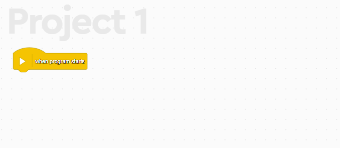
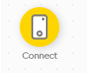

# Codifica tu primer programa

Con tu nuevo proyecto abierto, verás que ya tienes un bloque de código en la pantalla, **When program starts**. Este bloque le indica al robot que cuando el programa inicie, debe ejecutar las instrucciones que están dentro de él.

## Activa tu hub

Para que el hub pueda recibir instrucciones, debes activarlo. Para ello, debes dar clic en el botón de **Connect** en la esquina superior derecha de la pantalla.

## Programa tu hub

Ahora que tu hub está activo, puedes programarlo. Para ello mostraremos un icono en la matriz de luces del hub. Para ello, haremos click en icono de *Light* en la barrra lateral izquierda y arrastraremos el bloque **turn on..** abajo del bloque **When program starts**.

