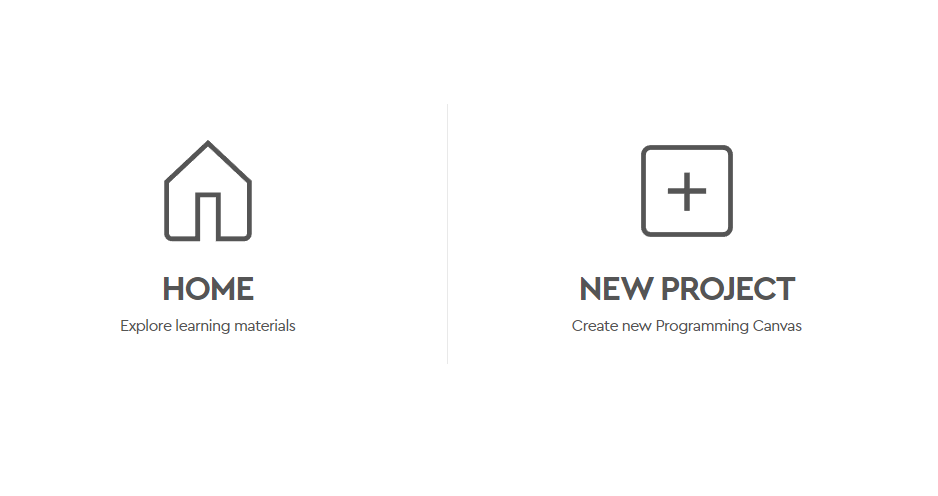
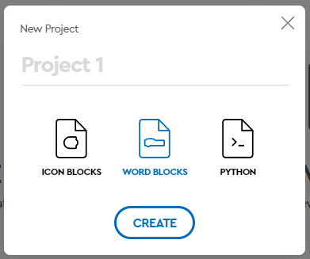

# Introducción

Para esta clase utilizaremos el kit de Lego Education SPIKE Prime, el cual incluye un hub, sensores y motores. El hub es el cerebro del robot, el cual se conecta a la computadora y recibe instrucciones para realizar las acciones que se le indiquen. Los sensores son los que le permiten al robot percibir el mundo que lo rodea, y los motores son los que le permiten al robot moverse.

## Crea un nuevo proyecto

Para crear un nuevo proyecto, debes abrir el software de [Lego Education SPIKE Prime](https://spike.legoeducation.com/prime/project) y dar clic en el botón de **New Project**.

Dale un nombre a tu proyecto, selecciona **World Blocks** y da clic en **Create**.

