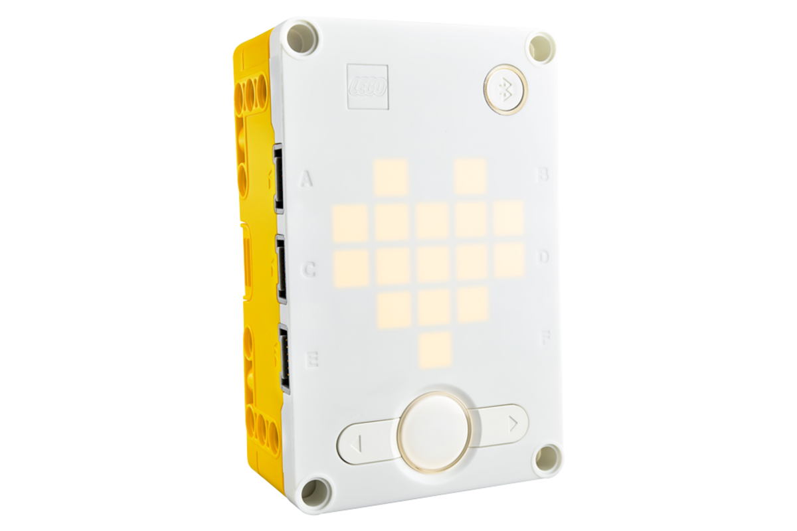
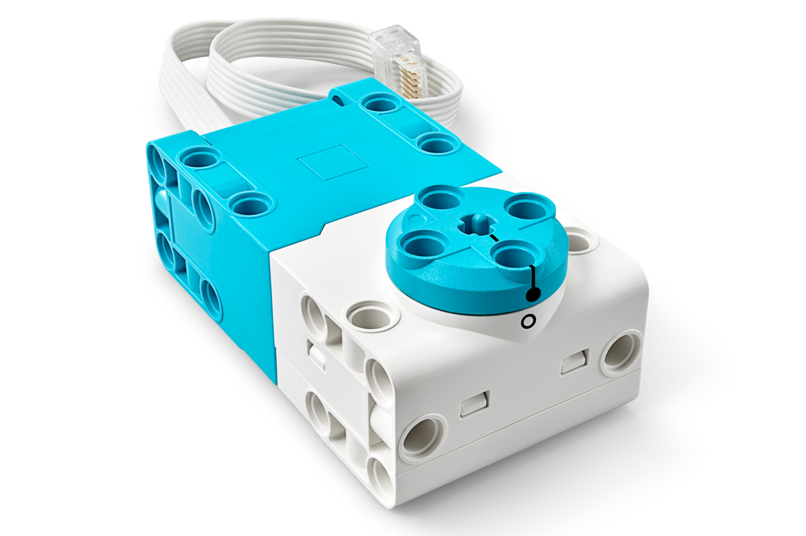
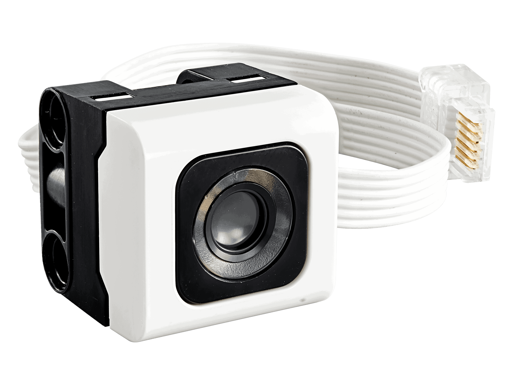
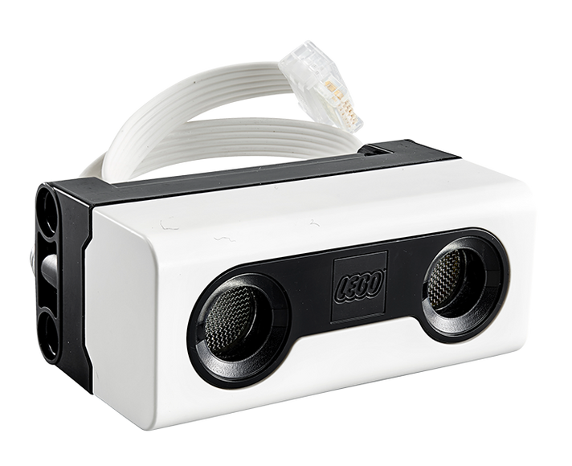
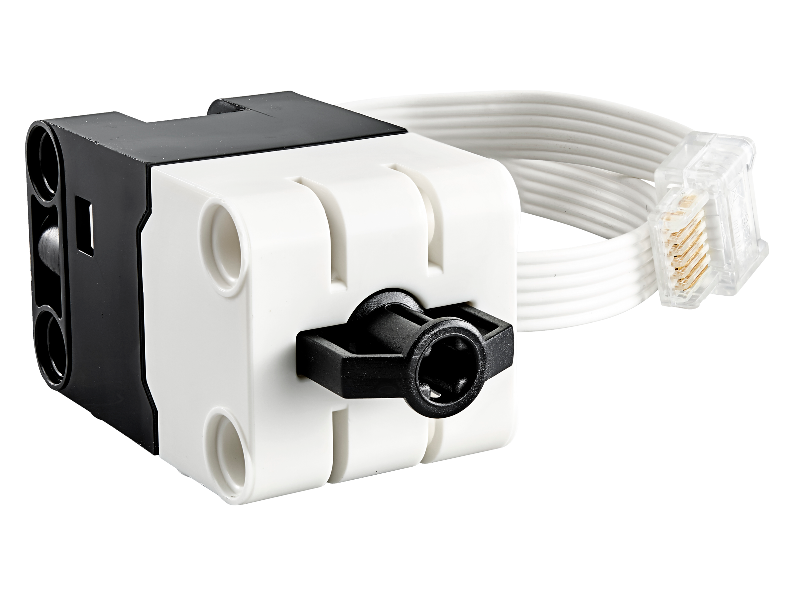
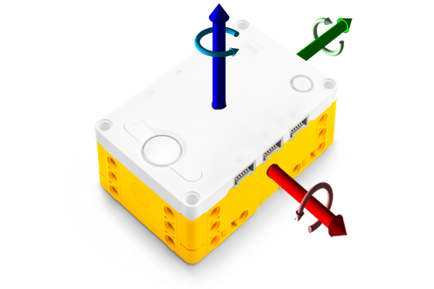

# Prototipar

:::info[Importante]
**Duracion:** 60 minutos
:::

## Objetivos de la Fase:
- Familiarizarse con los componentes del kit de Lego Education Spike Prime.
- Aprender a manipular y utilizar los motores, sensores y el hub programable.
- Explorar y utilizar el software SPIKE™ App v. 3.4.3.

## Introducción y Reparto de Equipos

Tiempo: 10 minutos

:::tip[Narrativa]
_"Vamos a comenzar nuestra sesión de prototipado. Hoy, aprenderemos sobre los componentes del kit de Lego Education Spike Prime y cómo utilizar el software SPIKE para programarlos. Será una experiencia divertida y emocionante, explorando juntos cómo podemos manipular y programar estos componentes."_
:::

### Instrucciones:
1. Reparto de Equipos:
    - Asigna a cada grupo un kit de Lego Education Spike Prime y una computadora o tablet con el software SPIKE™ App v. 3.4.3 instalado.
2. Configuración Inicial:
    - Asegúrate de que cada grupo encienda su hub programable y lo conecte a su dispositivo mediante Bluetooth o USB.
Verifica que todos los grupos tengan acceso al software SPIKE™ App y estén listos para comenzar.

## Exploración del Software SPIKE™ App v. 3.4.3
Tiempo: 10 minutos

:::tip[Narrativa]
_"El software SPIKE será nuestra herramienta principal para programar y controlar los componentes de nuestros robots. Vamos a explorar juntos cómo navegar por el software y comenzar con los tutoriales interactivos."_
:::

### Instrucciones:
1. Exploración del Software:
    * Guía a los estudiantes a través de la interfaz del software, destacando las secciones principales: Inicio, Tutoriales y Proyectos.
    * Explica cómo acceder a los tutoriales y qué esperar de ellos.
2. Inicio del Tutorial:
    * Indica a los estudiantes que abran el tutorial de inicio en la sección "Comenzar" del software.

## Tutoriales Interactivos de Componentes
*Duración: 35 minutos*

:::tip[Narrativa]
"Vamos a seguir los tutoriales interactivos que nos ayudarán a entender cómo usar cada uno de los componentes del kit. Estos tutoriales nos guiarán paso a paso en el proceso de conectar, programar y probar los motores y sensores."
:::

### Uso de la Matriz de Luces (Brick)

**Tutorial:**
- Los estudiantes seguirán el tutorial en el software que muestra cómo programar y manipular la matriz de luces en el hub.

**Actividad Práctica:**
- Programar la matriz de luces para mostrar un icono o patrón de luces específico.

### El Motor

**Tutorial:**
- Los estudiantes seguirán el tutorial sobre cómo conectar y programar el motor.

**Actividad Práctica:**
- Programar el motor para realizar un movimiento básico, como girar en una dirección específica.

### El Sensor de Color

**Tutorial:**
- Los estudiantes seguirán el tutorial para aprender a usar el sensor de color para detectar diferentes colores.

**Actividad Práctica:**
- Programar una respuesta basada en la detección de diferentes colores, como cambiar el color de las luces del hub.

### El Sensor de Distancia

**Tutorial:**
- Los estudiantes seguirán el tutorial sobre el uso del sensor de distancia para medir proximidad.

**Actividad Práctica:**
- Programar una acción en respuesta a la detección de un objeto cercano, como detener el motor o cambiar la dirección.

### El Sensor de Fuerza

**Tutorial:**
- Los estudiantes seguirán el tutorial para aprender a usar el sensor de fuerza para detectar presión.

**Actividad Práctica:**
- Programar una acción basada en la presión aplicada, como encender una luz cuando se aplica suficiente presión.

### El Sensor Giroscópico

**Tutorial:**
- Los estudiantes seguirán el tutorial sobre cómo usar el sensor giroscópico para detectar la orientación.

**Actividad Práctica:**
- Programar una respuesta basada en el cambio de orientación, como emitir un sonido cuando se inclina el hub.

:::warning[Nota Importante]
Esta fase de "Prototipar" está diseñada para que los estudiantes se familiaricen completamente con los componentes del kit de Spike Prime y el software de programación, siguiendo los tutoriales del software. Esta familiarización es esencial para que puedan avanzar a las fases de construcción y programación con confianza y habilidad.
:::

